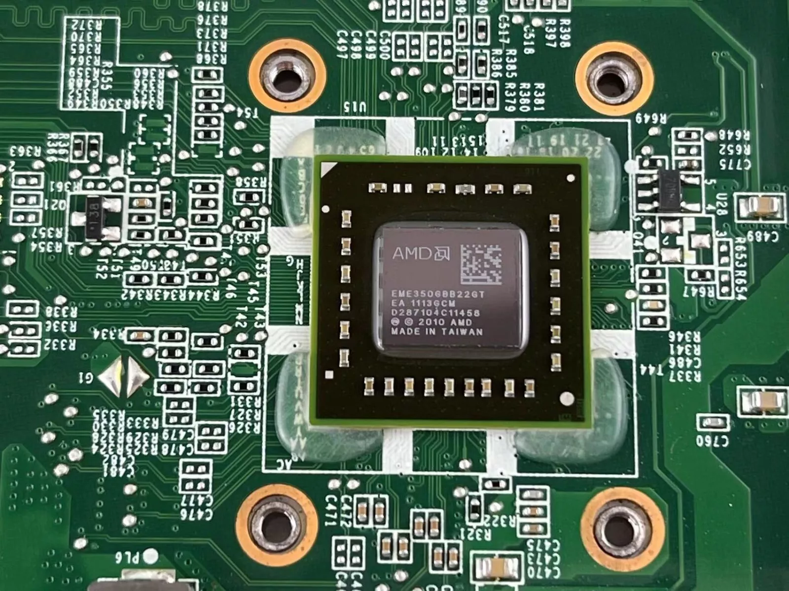
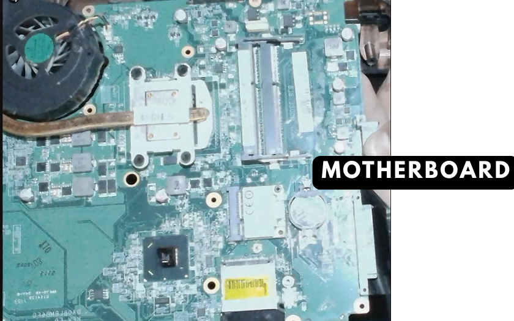
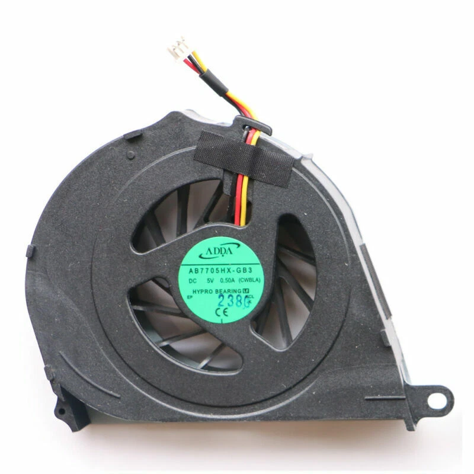
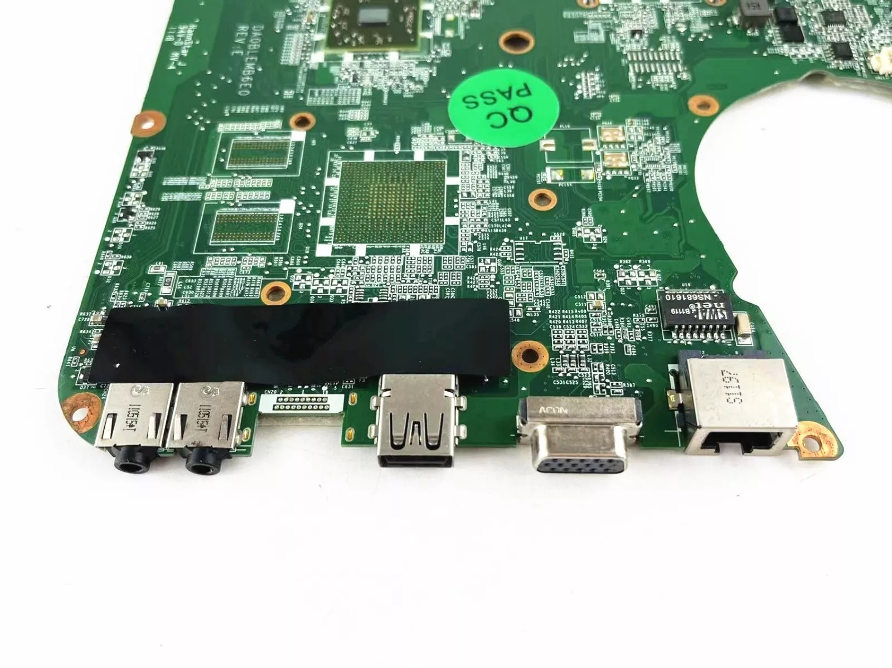
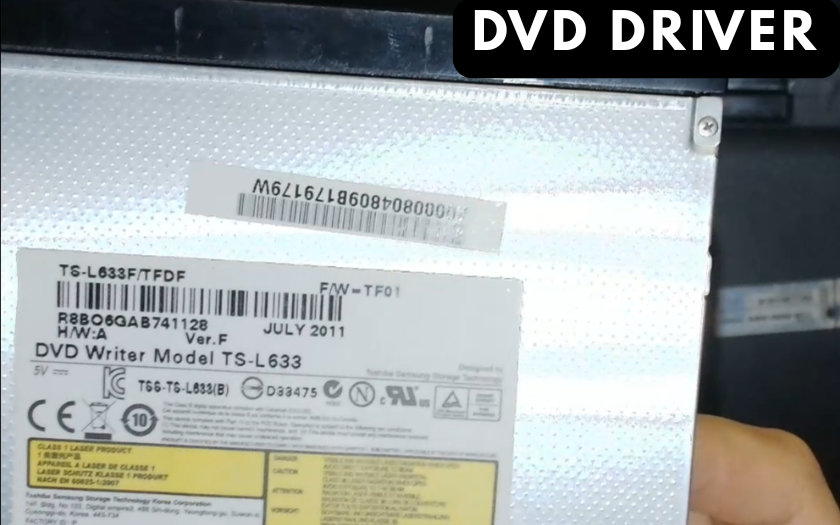

# Laptop Components Portfolio

## CPU (Central Processing Unit)

The CPU is the **brain of the computer** that executes all instructions and performs calculations.  
It's the primary component responsible for processing data and running applications.

- **Instruction Execution** – processes program instructions and performs calculations
- **Clock Speed** – determines how many operations the CPU can perform per second
- **Cores** – multiple processing units that can handle tasks simultaneously
- **Cache Memory** – high-speed memory built into the CPU for frequently accessed data
- **Thermal Management** – generates heat that must be managed by the cooling system

---

## Motherboard

The motherboard is the **main circuit board** that connects all the components of the laptop together.  
It serves as the central nervous system of the computer, providing electrical connections and communication pathways between all hardware components.

- **CPU Socket** – houses the processor and provides power and data connections
- **RAM Slots** – accommodate memory modules for temporary data storage
- **Expansion Slots** – allow for additional components like graphics cards or network adapters
- **Chipset** – manages data flow between the CPU, memory, and peripheral devices
- **BIOS/UEFI** – firmware that initializes hardware during startup

---

## Intel HM65 Mobile Chipset

The Intel HM65 is a **mobile chipset** designed specifically for laptop computers.  
It acts as the communication hub between the processor and other system components.

- **Memory Controller** – manages RAM access and timing
- **PCI Express Controller** – handles high-speed data transfer for graphics and storage
- **USB Controller** – manages USB device connections and data transfer
- **SATA Controller** – controls hard drive and SSD connections
- **Audio/Network Integration** – provides built-in audio and network functionality

---

## 2 GB DDR3 Laptop RAM Stick

RAM (Random Access Memory) provides **temporary storage** for data that the CPU needs to access quickly.  
It's much faster than storage drives but loses all data when power is turned off.

- **DDR3 Technology** – third generation of Double Data Rate memory with improved speed and efficiency
- **2 GB Capacity** – stores active programs, operating system data, and temporary files
- **Volatile Memory** – requires constant power to maintain data
- **Dual-Channel Support** – can work with another identical stick for improved performance
- **Laptop Form Factor** – smaller physical size designed for portable computers

---

## 240GB Solid State SSD

A Solid State Drive (SSD) provides **permanent storage** for the operating system, applications, and user data.  
Unlike traditional hard drives, SSDs use flash memory with no moving parts for faster access and improved reliability.

- **Flash Memory** – stores data electronically without mechanical components
- **240 GB Capacity** – holds operating system, applications, and user files
- **High Speed** – significantly faster read/write speeds compared to traditional hard drives
- **Durability** – resistant to physical shock and vibration
- **Energy Efficient** – lower power consumption than mechanical drives

---

## Cooling Fan

The cooling fan is a **thermal management component** that prevents the laptop from overheating.  
It works with heat sinks to dissipate heat generated by the CPU, GPU, and other components.

- **Heat Dissipation** – removes hot air from inside the laptop chassis
- **Variable Speed** – adjusts fan speed based on system temperature and workload
- **Noise Management** – designed to operate quietly during normal use
- **Dust Filtration** – helps prevent dust buildup that can reduce cooling efficiency
- **Thermal Protection** – works with temperature sensors to prevent component damage

---

## Heat Sink (Not Pictured)

The heat sink is a **passive cooling component** that works in conjunction with the cooling fan to manage system temperatures.  
It's typically made of aluminum or copper and is attached directly to the CPU and other heat-generating components.

- **Thermal Conduction** – absorbs heat from the CPU and transfers it to the cooling fan
- **Metal Construction** – aluminum or copper fins provide large surface area for heat dissipation
- **Thermal Paste Interface** – ensures efficient heat transfer between CPU and heat sink
- **Passive Cooling** – works without moving parts, relying on thermal conductivity
- **Component Protection** – prevents thermal throttling and component damage

---

## Laptop Battery PA3817U-1BRS

The laptop battery provides **portable power** when the laptop is not connected to an electrical outlet.  
It stores electrical energy chemically and converts it to electrical power for the laptop's operation.

- **Lithium-Ion Technology** – modern battery chemistry with high energy density
- **PA3817U-1BRS Model** – specific battery model for Toshiba Satellite L750 series
- **Rechargeable** – can be charged and discharged hundreds of times
- **Power Management** – works with the laptop's power management system
- **Safety Features** – includes protection against overcharging and overheating

---

## Ports & Connectors

The laptop features various **input/output ports** that allow connection to external devices and networks.

### **LAN Jack (Ethernet Port)**

- **Wired Network Connection** – provides high-speed internet access via Ethernet cable
- **RJ-45 Connector** – standard network interface for local area networks
- **Gigabit Ethernet** – supports data transfer speeds up to 1 Gbps
- **Reliable Connection** – more stable than wireless connections for critical applications

### **Monitor Port (VGA/DVI/HDMI)**

- **External Display Output** – allows connection to external monitors or projectors
- **Multiple Display Support** – extends or mirrors the laptop screen
- **Presentation Capability** – useful for business presentations and multimedia
- **High-Resolution Support** – can output to displays with higher resolution than laptop screen

### **USB 3.0 Ports**

- **High-Speed Data Transfer** – provides fast connection for external storage and peripherals
- **Backward Compatibility** – works with older USB 2.0 and 1.1 devices
- **Power Delivery** – can charge devices and power external hard drives
- **Multiple Device Support** – allows connection of keyboards, mice, storage devices, etc.

### **Microphone/Headphone Jacks**

- **Audio Input/Output** – provides connection for external audio devices
- **3.5mm Connector** – standard audio interface for headphones and microphones
- **Audio Recording** – enables voice recording and communication applications
- **Audio Playback** – allows private listening without disturbing others

---

## DVD Drive

The DVD drive is an **optical storage device** that reads and writes data to optical discs.  
It uses laser technology to read data from CDs, DVDs, and Blu-ray discs.

- **Optical Technology** – uses laser light to read data from reflective discs
- **Multiple Formats** – supports CD, DVD, and sometimes Blu-ray media
- **Read/Write Capability** – can read existing discs and write data to blank media
- **Slim Design** – compact form factor designed for laptop integration
- **External Interface** – connects to the motherboard via SATA or USB

---

## Graphics Processing Unit (GPU) - Optional Component

Some Toshiba Satellite L750 models include a **dedicated graphics card** for enhanced visual performance.  
This component is not present in all configurations and may use integrated graphics instead.

- **Discrete Graphics** – separate graphics card for improved gaming and multimedia performance
- **Video Memory** – dedicated VRAM for graphics processing tasks
- **Multiple Display Support** – can drive multiple external displays simultaneously
- **Hardware Acceleration** – accelerates video encoding, decoding, and 3D rendering
- **Power Management** – may have its own cooling and power requirements

---

## Toshiba Satellite L750 (Complete Laptop)

The Toshiba Satellite L750 is a **complete laptop computer** that integrates all the individual components into a portable computing system.

- **15.6-inch Display** – provides visual output for the user interface
- **Integrated Components** – houses motherboard, processor, memory, storage, and other parts
- **Portable Design** – lightweight construction with built-in battery for mobile use
- **Input Devices** – includes keyboard, touchpad, and various ports for peripherals
- **Cooling System** – manages heat generated by internal components

---

## Open Laptop (Internal View)

This view shows the **internal layout** of a laptop computer with its components exposed.  
It demonstrates how all the individual parts work together within the compact laptop chassis.

- **Component Integration** – shows how motherboard, memory, storage, and other parts are positioned
- **Space Optimization** – demonstrates efficient use of limited internal space
- **Cooling Design** – reveals heat sinks, fans, and ventilation for thermal management
- **Cable Management** – shows how internal wiring connects components
- **Accessibility** – illustrates how components can be accessed for maintenance or upgrades

---

## Component Interaction Summary

| Component              | Primary Function         | Key Characteristics                             |
| ---------------------- | ------------------------ | ----------------------------------------------- |
| **CPU**                | Data processing          | Executes instructions and performs calculations |
| **Motherboard**        | Central connection hub   | Routes data between all components              |
| **Intel HM65 Chipset** | Communication controller | Manages data flow and peripheral connections    |
| **DDR3 RAM**           | Temporary data storage   | Fast access memory for active programs          |
| **SSD**                | Permanent storage        | High-speed storage for OS and files             |
| **Cooling Fan**        | Thermal management       | Prevents overheating and maintains performance  |
| **Heat Sink**          | Passive cooling          | Absorbs and transfers heat from components      |
| **Battery**            | Portable power source    | Provides mobile operation capability            |
| **Ports**              | External connectivity    | Enables device and network connections          |
| **DVD Drive**          | Optical media access     | Reads/writes optical discs                      |
| **GPU**                | Graphics processing      | Optional dedicated graphics card                |
| **Complete Laptop**    | Integrated system        | Combines all components into portable unit      |

## System Architecture

The laptop follows a **hierarchical architecture** where:

- The **CPU** processes all data and executes instructions (most critical)
- The **motherboard** serves as the foundation connecting all components
- The **chipset** manages data flow and peripheral communication
- **RAM** provides fast temporary storage for active processes
- **SSD** offers permanent storage for the operating system and data
- The **cooling fan** and **heat sink** maintain optimal operating temperatures
- **Battery** enables portable operation
- **Ports** provide external connectivity for devices and networks
- **Optical drive** provides additional storage and media access capabilities
- **GPU** (if present) handles graphics processing and display output

All components work together to create a fully functional, portable computing system capable of running applications, storing data, and providing user interaction through various input/output devices.
